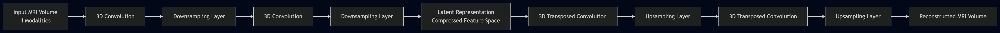

# 3D Autoencoder Architecture

The proposed model is a 3D convolutional autoencoder designed to learn a compact latent representation of multi-modal brain MRI volumes.

## Encoder
The encoder progressively compresses the input MRI volume using 3D convolution layers and downsampling.

## Latent Space
The compressed representation captures structural information about brain anatomy.

## Decoder
The decoder reconstructs the MRI volume from the latent representation using transposed convolutions.
