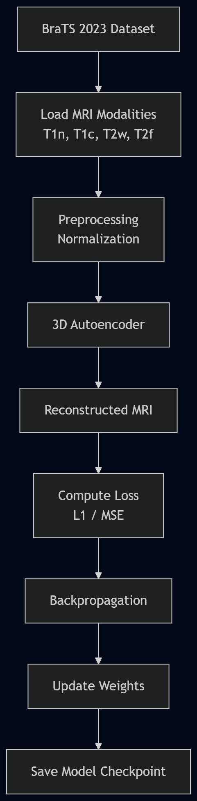

# Training Pipeline

The model is trained using the BraTS 2023 dataset.

Steps:

1. Load MRI dataset
2. Preprocess modalities (T1n, T1c, T2w, T2f)
3. Feed into 3D autoencoder
4. Compute reconstruction loss
5. Backpropagation
6. Save model checkpoints
