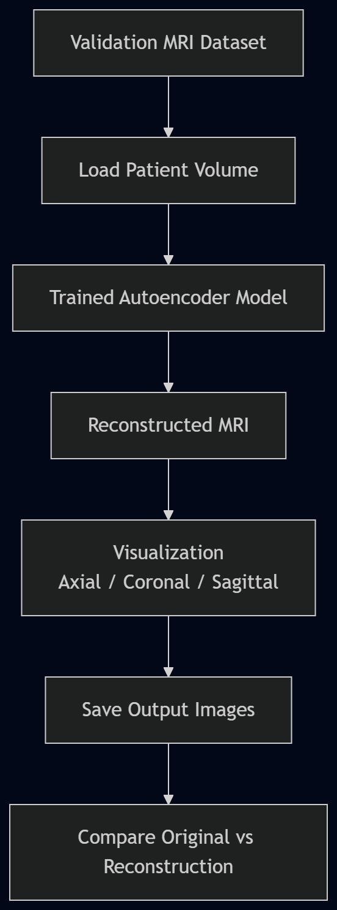

# Validation Pipeline

The trained autoencoder is evaluated on unseen validation MRI scans.

Steps:

1. Load validation patient MRI
2. Pass through trained autoencoder
3. Generate reconstruction
4. Compare original vs reconstructed
5. Save visualization
